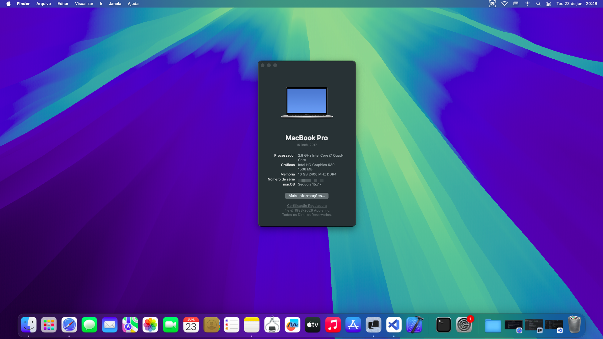
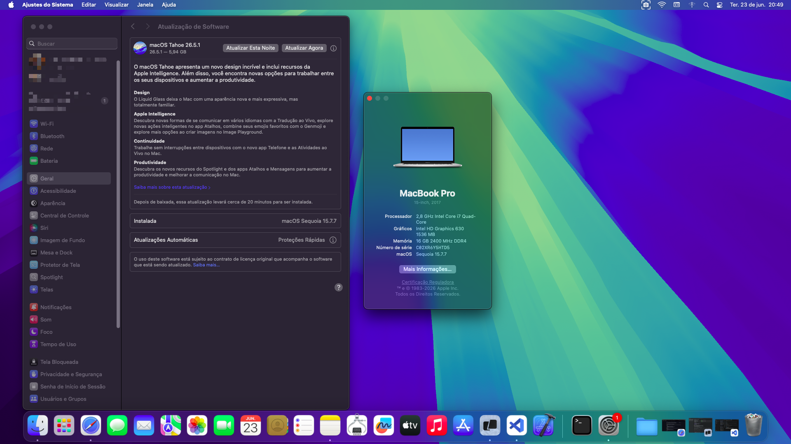
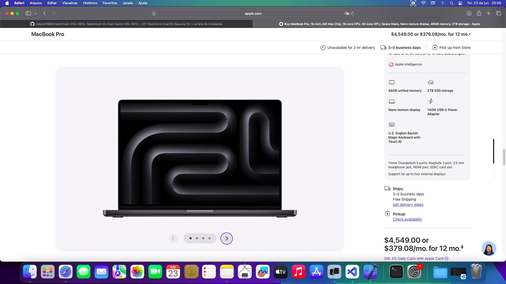
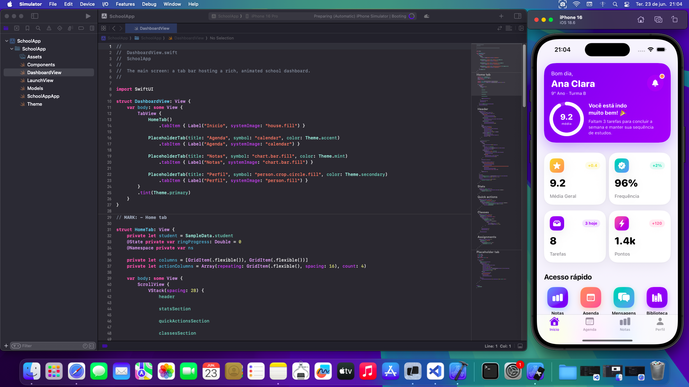

# 🍎 Hackintosh — Acer Aspire VX5‑591G (macOS Sequoia)

<p align="center">
  <a href="README-ptbr.md">🇧🇷 Leia em Português</a>
</p>

<p align="center">
  <a href="https://github.com/cleyton1986/Hackintosh-VX5-591G/releases"></a>
  
  
  
  <a href="LICENSE"></a>
  
</p>

**OpenCore** EFI + scripts to install **macOS Sequoia 15** on the **Acer Aspire VX5‑591G** laptop —
preparing everything from a **Linux PC** (or macOS itself), **no Mac required**.

> ⚠️ Hackintosh is for **study/testing**. Use at your own risk.

---

## 💻 Tested hardware

| Component | Detail | macOS |
|---|---|---|
| Model | Acer Aspire VX5‑591G | ✅ |
| CPU | Intel Core **i7‑7700HQ** (Kaby Lake) | ✅ |
| iGPU | **Intel HD Graphics 630** | ✅ accelerated (Metal 3) |
| Dedicated GPU | NVIDIA GTX 1050Ti | ⛔ disabled (no macOS driver) |
| Audio | Realtek **ALC255** | ✅ |
| Wi‑Fi | Intel **7265** | ✅ via `itlwm` + HeliPort app |
| Bluetooth / Ethernet | Intel / Realtek RTL8111 | ✅ |
| 15.6" 1080p display, keyboard, trackpad, brightness | | ✅ |
| **External HDMI** | wired to the iGPU | ❌ not working on Sequoia (Kaby Lake limitation) |

---

## ✅ What works

Accelerated graphics, audio, Wi‑Fi (with **HeliPort**), Bluetooth, Ethernet, USB, keyboard, trackpad, brightness, iCloud.

⛔ **Do NOT update to macOS Tahoe (26)** — it removes audio on Intel chips (ALC255 stops working). **Stay on Sequoia 15.**

---

## 📸 Screenshots

<table>
  <tr>
    <td align="center" width="50%">
      <br>
      <sub><b>About This Mac</b> — i7‑7700HQ · HD630 · 16GB</sub>
    </td>
    <td align="center" width="50%">
      <br>
      <sub><b>System Settings</b> — Software Update</sub>
    </td>
  </tr>
  <tr>
    <td align="center" width="50%">
      <br>
      <sub><b>Safari</b> — internet working</sub>
    </td>
    <td align="center" width="50%">
      <br>
      <sub><b>Xcode + iPhone Simulator</b> — iOS development</sub>
    </td>
  </tr>
</table>

---

## 📂 Project structure

```
.
├── README.md                ← this file (overview — English, default)
├── README-ptbr.md           ← Portuguese version
├── EFI/                      ← ready OpenCore EFI (generate your own serial — step 1)
├── scripts/
│   ├── create-usb.sh         ← downloads macOS + builds the install USB (automatic)
│   └── gen-smbios.sh         ← generates your own serial (SMBIOS)
├── docs/
│   └── INSTALACAO.md         ← detailed manual guide + troubleshooting (PT-BR)
├── assets/                   ← system screenshots
└── .gitignore
```

---

## 🚀 Quick start (scripts)

> Requirements: **Linux** or **macOS**, with `git`, `python3`, `curl`, `unzip`.
> On Linux also: `sgdisk`, `mkfs.vfat`, `mkfs.exfat`, `wipefs`.

### 1) Generate your serial (required)
The EFI ships **without a serial** (each Hackintosh needs a unique one):
```bash
./scripts/gen-smbios.sh --inject
```
> Writes `Serial`, `MLB` and `UUID` to `EFI/OC/config.plist`. (`ROM` = your network MAC is optional — see the guide.)

### 2) Create the install USB (erases the USB!)
Find the USB disk with `lsblk` (Linux) or `diskutil list` (macOS), then run:
```bash
# Linux
sudo ./scripts/create-usb.sh --disk /dev/sdX

# macOS
sudo ./scripts/create-usb.sh --disk /dev/diskN
```
The script **downloads macOS Sequoia** (BaseSystem + full installer), **partitions** the USB and **copies** the EFI + installer. 🪄

Useful options:
- `--mode online` → recovery only (smaller USB, ≥8GB; installs over the internet)
- `--skip-download` → reuse what was already downloaded in `downloads/`
- `--help` → all options

### 3) Install
Plug it into the Acer → **F2** (BIOS: Secure Boot **OFF**, UEFI) → **F12** → boot from the USB → follow the `LEIA‑PRIMEIRO.txt` the script left on the USB (or the **[detailed guide](docs/INSTALACAO.md)**).

---

## 📖 Full guide

Detailed step‑by‑step (BIOS, manual download, building the USB by hand, install, post‑install, Wi‑Fi, and
**troubleshooting**) in **[docs/INSTALACAO.md](docs/INSTALACAO.md)** *(in Portuguese)*.

---

## ⚙️ EFI technical summary

OpenCore **1.0.6** · SMBIOS `MacBookPro14,3` · native KBL HD630 iGPU `0x591b0000` · ALC255 layout 99 ·
dGPU disabled (`SSDT-DDGPU`) · Wi‑Fi `itlwm` · Ethernet RTL8111 · `SecureBootModel = Disabled`.
Full details in the [guide](docs/INSTALACAO.md#️-detalhes-técnicos-da-efi).

---

## 🙏 Credits

- [Acidanthera](https://github.com/acidanthera) — OpenCore, Lilu, WhateverGreen, VirtualSMC
- [OpenIntelWireless](https://github.com/OpenIntelWireless) — `itlwm` + HeliPort
- [OpCore‑Simplify](https://github.com/lzhoang2801/OpCore-Simplify) — EFI generation
- [corpnewt](https://github.com/corpnewt) — gibMacOS, GenSMBIOS
- [Dortania](https://dortania.github.io/OpenCore-Install-Guide/) — reference guide

---

## ☕ Support the Project

If this project was useful to you and you'd like to support its development, consider buying me a coffee:

<p align="center">
  <a href="https://www.paypal.com/cgi-bin/webscr?cmd=_donations&business=cleyton1986%40gmail.com&currency_code=BRL&item_name=Hackintosh+VX5-591G">
    
  </a>
</p>

<p align="center">
  <b>PIX (Brazil):</b> <code>cleyton1986@gmail.com</code>
</p>

Any contribution is voluntary and greatly appreciated! It helps keep the project alive and motivates new features.

---

## 📄 License

This project is licensed under the **GNU General Public License v3.0** — see the [LICENSE](LICENSE) file for details.

> Bundled third‑party components (OpenCore, Lilu, WhateverGreen and other kexts) retain their own licenses.

**This software is provided "as is", without warranty of any kind.** Hackintosh is for educational/testing purposes — use at your own risk.

---

<p align="center">
  <b>Developed by OctalDev — Cleyton Alves</b> | Senior Software Engineer
</p>

> Built for the **Acer Aspire VX5‑591G**. If it helped, leave a ⭐. Hackintosh is for study/testing. 🚀
